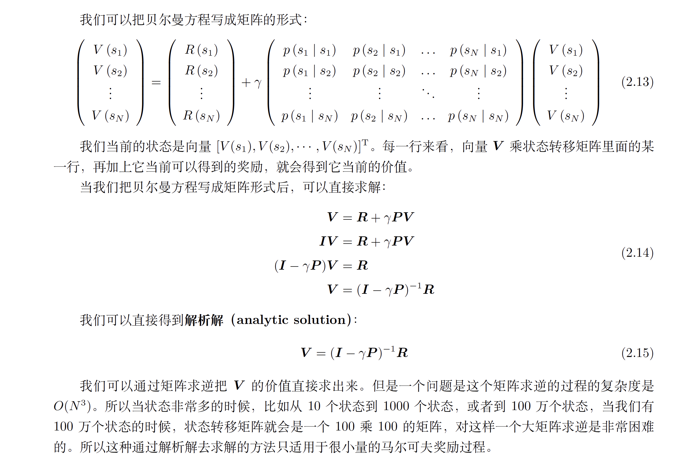
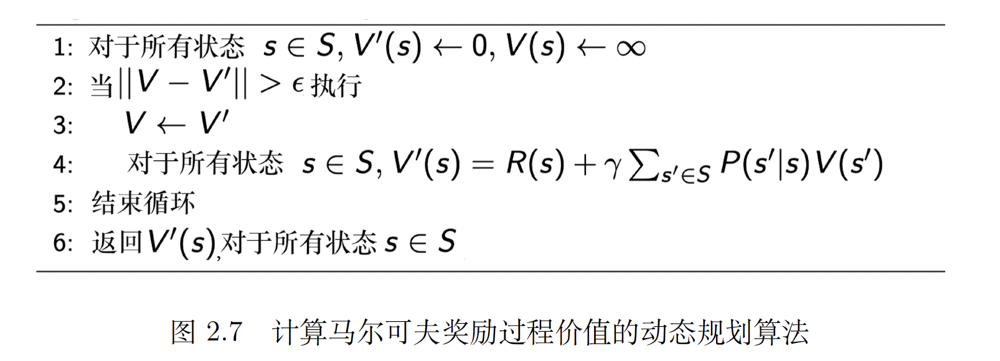
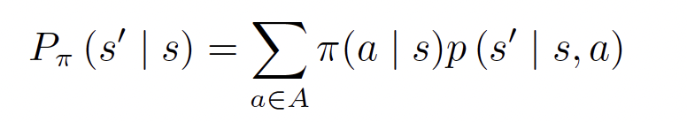
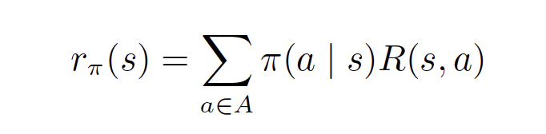

[toc]

# Reinforcement Learning

## 2. 马尔可夫奖励过程（Markov reward process, MRP）--

## 回报 与 价值 

在 reinforcement learning中， 需要根据动作，得到state， 并得到相应的 回报--- 当前状态下（特定的following 发展路径下）有多少价值

对于一个状态的价值----是由当前回报和未来回报共同决定的 （discount factor  guarantee that we want immediate reward ）

对于当前的state， 可以有无数种 following states，所以当前state 的价值 实际上 是对当前 state **回报**s 的**expectation** （期望）--- 状态价值函数（state-value function）
$$
V^t(s) = E [G_t | s_t= s] \\
= E [ r_{t+1} + γ\times r_{t+2} + γ^2r_{t+3} + . . . + γ^{T−t−1}r_T | s_t = s]
$$

可以通过列举 multiple  发展路径，并结合这些路径，计算当前state 的 价值期望 （expectation of those multiple path）

### 贝尔曼方程

在贝尔曼方程中， 某个状态的价值 = 当前的即时价值 + follow state 价值的期望 
$$
V (s) = R(s) + γ \sum_{s^{'}\in S} p(s^{'}|s)V(s^{'})
$$
从方程可以看出， 当前 state 的价值受未来 state 价值的影响 --- 彼此之间 存在迭代关系

#### 求解

##### 解析解--求 state-values

对于状态数 很多的 情况，可以用下列方式 进行求解

##### 1. 蒙特卡洛法：

##### 

##### 2.迭代法:

##### 

## 马尔可夫决策过程

在奖励过程的基础上，已经了决策---- 当前state 的价值 不仅取决于当前 的state 本身，还取决于 当前 所采取的动作

策略由策略函数定义： 输入：state； 输出：采取某一策略的概率
$$
\pi (a|s) = p(a_t = a | s_t = s)
$$
在马尔可夫决策过程中，状态之间的转移与action 有关，所以有如下的 状态转移 方程：

对于奖励函数，当前的价值由 action和state共同决定， 所以对于存在不同action 的state，奖励函数由如下表示：

## 马尔可夫决策过程中的价值函数

Q function - **当前 state 和 action下** 的价值

V 和 Q 的关系

* 策略评估 -- 已知马尔可夫决策过程以及要采取的策略π ，计算价值函数Vπ(s) 的过程

### 预测与控制

* 预测（评估一个给定的策略）的输入是马尔可夫决策过程< S, A, P,R, γ > 和策略π，输出是价值函数Vπ。预测是指给定一个马尔可夫决策过程以及一个策略π ，计算它的价值函数，也就是计算每个状态的价值。

* 控制（搜索最佳策略）的输入是马尔可夫决策过程< S, A, P,R, γ >，输出是最佳价值函数（optimal value function）V ∗ 和最佳策略（optimal policy）π∗。

* 控制就是我们去寻找一个最佳的策略，然后同时输出它的最佳价值函数以及最佳策略。

* 寻找最佳策略的过程就是马尔可夫决策过程的控制过程。马尔可夫决策过程控制就是去寻找一个最佳策略使我们得到一个最大的价值函数值

## 第3章——表格型方法

* Q 表格 - 是一个 列举所有 state 和所有 actions 的二位表格； 表格中的对应位置 代表 对应情况下的 Q 值

* **强化**是指我们可以用下一个状态的价值来更新当前状态的价值，其实就是强化学习里面自举的概念

* 在强化学习里面，我们可以每走一步更新一次Q 表格，用下一个状态的Q 值来更新当前状态的Q 值，这

  种单步更新的方法被称为**时序差分方法**。

### 无模型 （Q的计算）

#### 蒙特卡洛方法

在无法获取马尔可夫决策过程的模型情况下，我们可以通过 **蒙特卡洛方法** 和 **时序差分方法** 来估计某个

给定策略的价值。

#### 时序差分

在不断的重复实验后，下一个状态的价值可以不断地强化影响上一个状态的价值

时序差分方法可以从不完整的回合中学习，并且结合了自举的思想

采样是指更新时通过采样得到一个期望。蒙特卡洛方法是纯采样的方法。动态规划方法没有使用采样，

它是直接用贝尔曼期望方程来更新状态价值的。时序差分方法使用了采样。时序差分目标由两部分组成，一部分是采样，一部分是自举

如果时序差分方法需要更广度的更新，就变成了动态规划方法（因为动态规划方法是把所有状态都考虑进去来进行更新）。如果时序差分方法需要更深度的更新，就变成了蒙特卡洛方法。

### 免模型的控制

由于在免模型的背景下，无法得到 当前状态的下 奖励函数和 转移矩阵， 所以无法估计Q函数

针对上述情况，我们引入了广义的策略迭代的方法。我们对策略评估部分进行修改，使用蒙特卡洛的方法代替动态规划的方法估计Q 函数。我们首先进行策略评估，使用蒙特卡洛方法来估计策略Q = Qπ，然后进行策略更新，即得到Q 函数后，我们就可以通过贪心的方法去改进它

#### Sarsa：同策略时序差分控制

#### Q 学习：异策略时序差分控制

我们再通过对比的方式来进一步理解Q 学习。Q 学习是异策略的时序差分学习方法，Sarsa 是同策略的时序差分学习方法。

Sarsa 在更新Q 表格的时候，它用到的是A′ 。我们要获取下一个Q 值的时候，A′ 是下一个步骤一定会执行的动作，这个动作有可能是ε-贪心方法采样出来的动作，也有可能是最大化Q 值对应的动作，也有可能是随机动作，但这是它实际执行的动作。

但是Q 学习在更新Q表格的时候，它用到的是Q 值Q(S′, a) 对应的动作，它不一定是下一个步骤会执行的实际的动作，因为我们下一个实际会执行的那个动作可能会探索。Q 学习默认的下一个动作不是通过行为策略来选取的，Q

学习直接看Q 表格，取它的最大化的值，它是默认A′ 为最佳策略选取的动作，所以Q 学习在学习的时候，不需要传入A′，即$a_{t+1}$ 的值。

总结一下**同策略和异策略的区别**。Sarsa 是一个典型的同策略算法，它只用了一个策略π，它不仅使用策略π 学习，还使用策略π 与环境交互产生经验。

如果策略采用ε-贪心算法，它需要兼顾探索，为了兼顾探索和利用，它训练的时候会显得有点“胆小”。它在解决悬崖行走问题的时候，会尽可能地远离悬崖边，确保哪怕自己不小心探索了一点儿，也还是在安全区域内。此外，因为采用的是ε-贪心算法，策略会不断改变（ε 值会不断变小），所以策略不稳定。

Q 学习是一个典型的异策略算法，它有两种策略——目标策略和行为策略，它分离了目标策略与行为策略。Q 学习可以大胆地用行为策略探索得到的经验轨迹来优化目标策略，从而更有可能探索到最佳策略。行为策略可以采用ε-贪心算法，但目标策略采用的是贪心算法，它直接根据行为策略采集到的数据来采用最佳策略，所以Q 学习不需要兼顾探索。我们比较一下Q 学习和Sarsa 的更新公式，就可以发现Sarsa 并没有选取最大值的最大化操作。因此，Q 学习是一个非常激进的方法，它希望每一步都获得最大的利益；Sarsa 则相对较为保守，它会选择一条相对安全的迭代路线。

